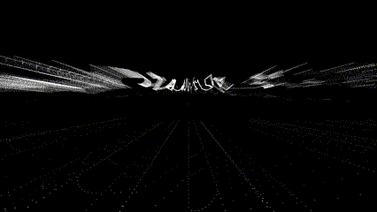
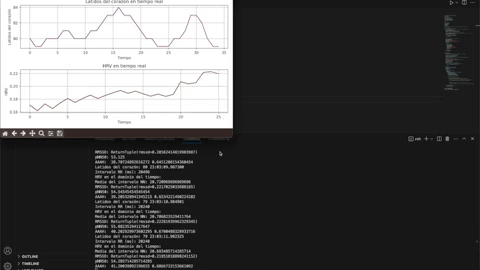
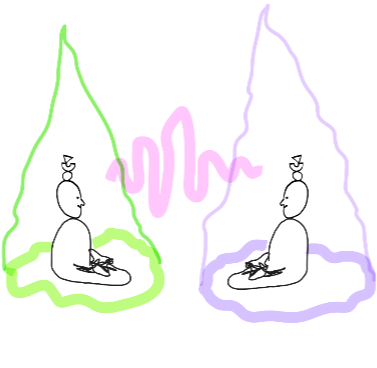
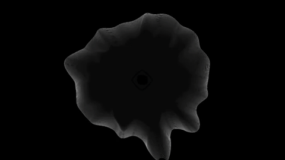

# MicroChallengeIII

## HRV and Conceptualizing Quantified Data

### **Introduction:**

Our overlapping interests in mental and physical health, coupled with a holistic perspective on wellness, led to an enlightening discourse. We delved into the inherent wisdom of our bodies, their constant expression of emotion, and the importance of heeding these signals. It dawned upon us that honoring our bodies' desires is paramount for leading a life imbued with wellness.

Driven by this realization, we ventured into prototyping a biofeedback device. The device's primary function is to facilitate the comprehension of data transmitted by our nervous systems. This understanding equips individuals with tools designed to enhance wellbeing.

We dared to imagine: What if we could decode and visualize the expressions of our nervous systems? Could such insights enable us to modulate our bodily states and the way our minds perceive existence?

To bring this vision to life, we decided to build a model that visualizes Heart Rate Variability (HRV). HRV refers to the fluctuations in the time intervals between consecutive heartbeats. These intervals consistently change, reflecting the balance or imbalance of the nervous system.

Our aspiration was simple: If we could provide a real-time visualization of HRV, could individuals learn to achieve balance? To that end, we started collecting heart rate data through ECG sensors, calculated the HRV of users, and visualized this information in an interactive and engaging manner. Our goal was to guide users to better understand their bodily states, empowering them to steer towards states that yield greater benefits.

At its core, HRV analysis aims to evaluate an individual's physiological state. It provides insights into the functioning of their autonomic nervous system, stress levels, and overall health. This method has found widespread applications in medical and research settings, sports science, and other fields where the essence of objective measurements and data-driven analysis is held in high esteem.

**Why so?**

Our ultimate aim is to attain a state of equilibrium and flow. This is possible by aligning ourselves with our internal wisdom and responding attentively to the signals our bodies dispatch.

We propose the adoption of biohacking techniques geared towards optimizing our nervous system. This process focuses on cultivating a sense of relaxation instead of perpetually staying on high alert, thereby enhancing our wellbeing.

Resonance frequency breathing is an effective method that allows us to achieve this balance. It involves harmonizing our breathing with our heart rate, leading to a state referred to as coherence. Coherence directly amplifies heart rate variability (HRV), paving the way towards the desired state of flow and equilibrium.

Through the application of this biofeedback technique, we can make more informed decisions concerning our overall wellbeing. HRV data analysis traditionally revolves around algorithmic measurements, primarily neglecting the emotional or empathetic aspects. The analysis process deploys mathematical algorithms, statistical methodologies, and scientifically accepted guidelines to derive significant information from the collected data.

Nevertheless, our aspiration extends beyond these conventional methods. We intend to integrate HRV analysis with visual art, aiming to obtain a more exhaustive, accessible, and holistic understanding of an individual's emotional and empathetic state.

### **Objecives**

With our installation, we aim to achieve the following:

1. **Emotional Expression**: We believe that visual art holds the power to convey emotions in a robust and expressive manner. By merging HRV analysis with visual art, we aim to personalize this process. This combination allows individuals to use art as a medium to visualize their internal flow. It encourages a profound exploration, connection, and communication of personal experiences.

2. **Subjective Interpretation**: While HRV analysis provides objective data, the interpretation of this data can be personalized through the integration of visual art. This subjectivity in interpretation fosters a more individualized understanding of one's emotional and empathetic state.

3. **Accessibility and Engagement**: One of the key advantages of visual art is its accessibility and appeal to a wide spectrum of people. This includes those who may not possess a scientific background or comprehend the technical intricacies of HRV analysis. Art can function as a bridge, simplifying complex physiological information and making it more relatable to a larger audience.

4. **Multidimensional Representation**: Our goal is to create a multidimensional understanding of emotional and empathetic states by merging HRV analysis with visual art. While HRV provides quantitative physiological data, visual art introduces a qualitative and sensory dimension that enhances interpretation.

5. **Therapeutic Benefits**: The process of engaging with health through a holistic expression can have therapeutic benefits. It promotes self-reflection, emotional processing, and stress reduction.

### **Installation 1: The Data Sculpture**

Our primary objective is to design an immersive visual experience that brings real-time data to life in a uniquely personal way. To achieve this, we plan to project the visual data, collected in real-time, directly onto a wall. Alternatively, we can display these visualizations on screens. 

By transforming abstract data into tangible visual representations, we hope to create a data sculpture that engages viewers on a deeper level, making complex information both accessible and impactful.

- *TouchDesigner*

TouchDesigner is a node-based visual programming language developed by the Canadian software company Derivative. It's used for creating real-time, interactive visuals, 3D animations, and immersive multimedia experiences. The software is known for its flexibility, wide range of capabilities, and use in professional settings such as live performances, interactive installations, music videos, and digital prototyping.

One of the most powerful aspects of TouchDesigner is its ability to handle different types of data, convert between them, and use them together. This feature makes TouchDesigner an incredibly versatile tool for designing interactive experiences and installations.

Here, we plugged data recorded from the POLAR10, and processed the final csv file into TouchDesigner. The outcome was a conceptual piece, meaning it was more about making art with initial data inputs, rather than a comprehensive understanding of the data itself.

- *Polar 10*

- *Python*

We used Python to accesss PolarH10 sensor data and analyze it to obtain an accurate HRV value. We connected to the PH10 using a Bleak, a python library to connect with BLE devices. We then used a library called PyHRV to calculate RR peaks and HRV values. This process was somewhat more complicated than we expected, since the sensor data provided multiple outputs and it required calibration and a lot of testing in order to achieve the desired results. 

We also began the development of an API using Flask + OpenAPI, so that we can use the analyzed data as an input for TouchDesigner, Arduino or any other applications that we might consider.

Here is the complete repository for our work in Python:
https://github.com/ServirGt/Biosensing

- *OpenHRV Open Sourced Interface*

### **Installation 02: Peer to Peer Coherence**

The objective of this installation is to guide users towards a state of coherence through collaboration with a peer, employing parasympathetic stimulation techniques and resources. The aim is to increase Heart Rate Variability (HRV) and synchronize it with the respiratory rate of a peer sitting opposite. The guiding lights projected from each user's position will assist them throughout this interactive experience.

The sequence of engagement would be as follows:

1. **Connection**: Users begin by connecting to the necessary sensors.

2. **Settling Down**: Once connected, users sit down comfortably on a meditation pillow.

3. **Initiating HRV Display**: Next, they activate the HRV "aura" display, which is a projected visual representation of HRV through the medium of color.

4. **Resonance Frequency Breathing (RFB)**: The users begin their RFB and coherence collaboration. 

5. **Visualizing Transformation**: As the users continue, they can visualize their HRV transformations via the changing color spectrum.

6. **Data Recording and Display**: All HRV sensor data is recorded throughout the experience and displayed through an interactive interface.

7. **Finalization and Feedback**: The interaction concludes with providing users feedback and insights based on their recorded HRV data. 

Through this interactive and collaborative installation, we aim to provide users with a tangible understanding of their own physiological states, leading to potential therapeutic benefits and an enhanced sense of wellbeing.

### **Next Steps**

1. Continue the development of our own API using Flask and OpenAPI which would allow us to run real-time data through Touch Designer.
2. Continue exploring and defining to what extent our installations are meaningul. We must ask ourselves:
    - Is this conceptualized format of data representation altering our audiences' perspectives on themselves and their own nervous system?
    - How can we use interfaces for means of interactivity and first-person-perspective iterations?