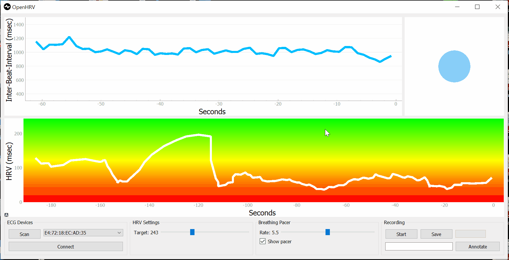

# MicroChallengeIII

## HRV and Conceptualizing Quantified Data

### Introduction:

HRV stands for Heart Rate Variability, and it is a measure of the variation in the time intervals between consecutive heartbeats. It is an important physiological indicator that provides insights into the health and functioning of the autonomic nervous system, which regulates various bodily functions.

The primary goal of HRV analysis is to assess the physiological state of an individual and provide insights into their autonomic nervous system function, stress levels, and overall health. It is often used in medical and research settings, sports science, and other fields where objective measurements and data-driven analysis are crucial.

We're working on a scientific approach to provide insights to a holistic concept for wellbeing.

**Why so?**

The interpretation of the results is typically done in a scientific and objective manner but these objective measurements can indirectly inform emotional and psychological states since HRV is influenced by factors such as stress, relaxation, and emotional arousal.

HRV is widely used in research, sports science, and healthcare to assess cardiovascular health, stress levels, emotional states, and overall well-being. It can provide valuable information about the body's physiological response to stress, exercise, recovery, and other factors.

The data analysis of HRV typically follows a scientific approach and focuses on objective measurements rather than emotional or empathetic aspects. HRV analysis involves mathematical algorithms, statistical methods, and established scientific guidelines to extract meaningful information from the data.

Our goal is to combine HRV analysis with visual art to gain a more comprehensive, accessible and holistic understanding of an individual's emotional and empathetic state.

Data is more than just numbers. With this installation we aim for:

Emotional expression: visual art has the potential to convey emotions in a powerful and expressive way. And we'll make it personal. By combining HRV analysis with visual art, individuals can use art as a tool for visualising their interior flow, allowing for a deeper exploration, connection and communication of their experiences.
Subjective interpretation: HRV analysis provides objective data, but the interpretation of that data can be subjective by incorporating visual art. This subjective interpretation allows for a more personalised understanding of their emotional and empathetic state.
Accessibility and engagement: visual art has the advantage of being accessible and engaging to a wide range of people, including those who may not have a scientific background or understand the technical aspects of HRV analysis. Art can serve as a bridge, making complex physiological information more accessible and relatable to a broader audience.
Multidimensional representation: by combining HRV analysis with visual art we aim to create a multidimensional aspect to the understanding of emotional and empathetic states. HRV provides quantitative physiological data, while visual art adds a qualitative and sensory dimension to the interpretation. This multidimensional representation can provide a richer and more nuanced understanding of individuals's health.
Therapeutic benefits: engaging with health by developing an holistic expression can have therapeutic benefits, promoting self-reflection, emotional processing, and stress reduction.

### Tools and Technologies

- TouchDesigner

- Polar 10

- Python
- OpenHRV Open Sourced Interface

